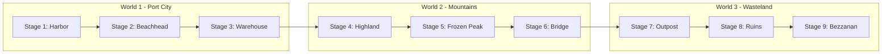
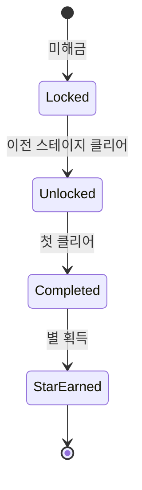
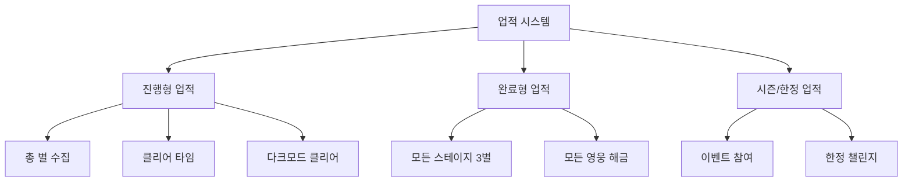
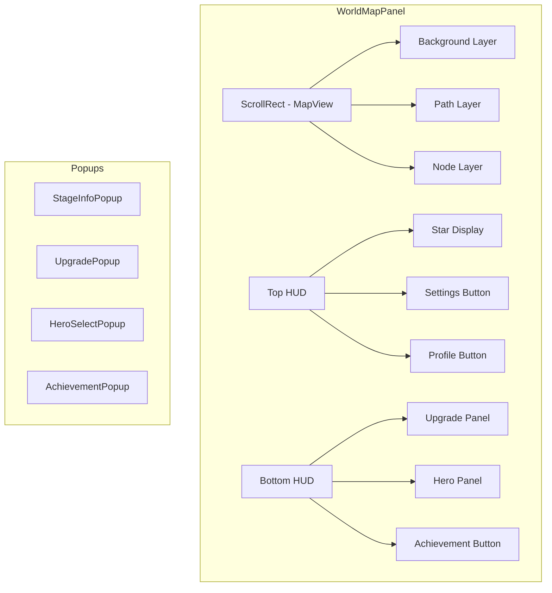
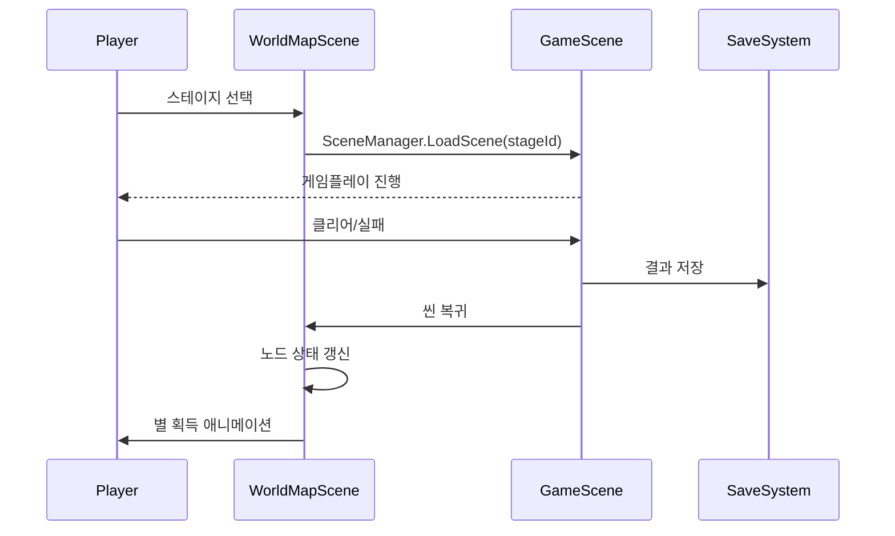

# 월드맵 시스템 기획 (World Map System Design) - Final Codex Edition

> **버전**: 3.0 (Codex + Technical Reinforcement + Extended Systems)
> **참조**: Kingdom Rush 시리즈 분석, Unity 구현 최적화, 확장 시스템 설계
> **최종 수정**: 2026-02-13

---

## 1. 개요

### 1.1 비전
킹덤러시(Kingdom Rush)의 스타일을 계승하여, 플레이어가 스테이지를 선택하고 게임의 진행 상황을 파악하며 영구적인 성장을 관리하는 메인 허브로서의 월드맵을 설계한다.

### 1.2 핵심 목표
- **플레이어 진행도 시각화**: 현재 위치와 목표를 명확히 표시
- **전략적 선택**: 난이도별 보상 차이로 인한 의미 있는 플레이 결정 유도
- **재플레이 가치**: 별 획득 및 업그레이드 시스템으로 반복 플레이 자극
- **캐릭터/영웅 성장**: 영웅 시스템으로 플레이어 투자 심화
- **확장 콘텐츠**: 업적, 빌런, 레이드 시스템으로 장기 게임 가치 창출

### 1.3 Kingdom Rush 레퍼런스 분석

| 요소 | Kingdom Rush | 본 프로젝트 적용 |
|------|--------------|------------------|
| 노드 스타일 | 손으로 그린 风톤 스프라이트 | 2D 카툰 스타일 + 시네마틱 연출 |
| 난이도 구조 | 3단계 (Normal/Heroic/Iron) | 동일 구조 유지 |
| 별 시스템 | 1-3개 + 숨겨진 목표 | 동일 + 추가 도전 과제 |
| 업그레이드 | 타워별 스킬 트리 | 별 소모 글로벌 스킬 트리 |
| 영웅 시스템 | 스테이지별 선택 + 레벨업 | 동일 + 스킨/커스터마이징 |

---

## 2. 시각적 스타일 및 테마

### 2.1 아트 스타일
- **2D 카툰(만화) 스타일**: 벡터 아트웍 느낌의 깔끔하고 아기자기한 디자인
- **반응형 UI**: 터치/마우스 인터랙션에 대한 시각적 피드백
- **애니메이션**: 상태 전환 시 부드러운 모션 (점프, 페이드, 깃발 꽂기)

### 2.2 월드 구성 및 구현 전략

**[Technical Implementation]**
- **Parallax Background**: 깊이감을 위해 3개 레이어로 분리 (근경, 중경-경로, 원경)
- **Camera System**: Orthographic 카메라 사용. 맵 경계(Bounds) 밖으로 나가지 않도록 `CameraClamp` 기능 구현.



| 월드 | 이름 | 테마 | 특징 |
|------|------|------|------|
| 1 | 항구 도시 | 평화로운 숲/초원 | 튜토리얼 및 초기 성장 |
| 2 | 산맥 및 설원 | 험난한 지형 | 중반 도전 |
| 3 | 황무지 | 어둡고 메마른 | 최종 보스 지역 |

### 2.3 맵 요소 및 리소스 구조
- **경로 표현**: `LineRenderer` 또는 스프라이트 타일링을 이용한 점선 표현.
- **클리어 마커**: Spine 또는 Sprite Animation 이용.
- **리소스 경로**: `Assets/Resources/WorldMap/` 하위에 관리.

---

## 3. 구조 및 기능

### 3.1 맵 탐색 및 스테이지 선택

#### 3.1.1 스크롤/드래그
- **구현**: Unity `ScrollRect`를 활용하되, 관성(Inertia)을 킹덤러쉬 특유의 느낌으로 튜닝.
- **Raycast Target**: 맵 배경은 터치를 받아야 하므로 Raycast Target 활성화, 그 외 장식 요소는 비활성화.

#### 3.1.2 스테이지 노드 (StageNode)



**[Component Design: `StageNode.cs`]**
- **State Pattern**: `Locked`, `Unlocked`, `Completed` 상태에 따라 스프라이트 교체 및 버튼 활성/비활성 처리.
- **Event**: `OnClick` 시 `StageInfoPopup` 호출.

### 3.2 스테이지 정보 팝업

#### 3.2.1 UI 구조
- **Base**: `BasePopup` 상속 (Common 라이브러리 활용)
- **Data Binding**: 선택된 `StageConfig` 데이터를 받아 UI 갱신.

#### 3.2.2 난이도 및 모드

| 모드 | 조건 | 설명 | 보상 |
|------|------|------|------|
| **Campaign** | 기본 | Casual/Normal/Veteran 선택 | 별 1~3개 |
| **Heroic** | 별 3개 | 엘리트 적, 웨이브 변경 | 추가 별 |
| **Iron** | 별 3개 | 타워 제한 등 하드코어 | 도전 보상 |

### 3.3 업그레이드 시스템

#### 3.3.1 별(Star) 재화 관리
- **전역 관리**: `GameManager.Instance.User.Stars`로 접근.
- **Reset 기능**: 별 투자 내역을 초기화하고 포인트를 반환하는 로직 필수.

#### 3.3.2 스킬 트리 구조
- **UI 구성**: 탭 방식이 아닌, 책을 펴는 듯한 UI 또는 단일 화면 내 탭 전환.

---

## 4. 확장 시스템 (Extended Systems)

### 4.1 업적 시스템 (Achievements)



**[AchievementConfig]**
- `achievementId`: 고유 식별자
- `title`: 업적명
- `description`: 설명
- `type`: 진행/완료/시즌
- `conditionType`: 조건 타입 (별수/시간/횟수)
- `conditionValue`: 조건 수치
- `reward`: 보상 (별/재화/배지)

### 4.2 빌런/라이벌 시스템 (Villains & Rivals)

| 빌런 | 등장ステージ | 특징 | 보상 |
|------|--------------|------|------|
|orc_warlord|World 1-3|전투력 중상, 방어력 높음|고급 영웅 해금|
|dark_mage|World 2-3|마법 공격, 아군 데미지|스킬 강화|
|demon_lord|World 3-3|최종 보스, 복합 공격|최종 보상|

**[VillainSystem]**
- 특정 스테이지 클리어 시 등장
- 1회성 또는 반복 도전 가능
- 클리어 시 특별 보상 및 스토리 진행

### 4.3 레이드/협동 전투 (Raids & Co-op) - v2 확장

**[RaidSystem]**
- **개인 레이드**: 강력한 단일 보스, 시간 제한
- **협동 레이드**: 다중 플레이어 (또는 AI 파티), 보상 공유
- **weekly/monthly 레이드**: 리더보드 시스템

### 4.4 일일/주간 도전 (Daily/Weekly Challenges)

| 유형 | 주기 | 내용 | 보상 |
|------|------|------|------|
| 일일 | 24시간 | 특정 조건 달성 | 소량의 별/재화 |
| 주간 | 7일 | 누적 과제 | 다량의 별/한정 배지 |

---

## 5. 데이터 구조 (Technical Reinforcement)

Design 데이터(변하지 않는 정보)와 User Data(변하는 정보)를 철저히 분리한다.

### 5.1 StageConfig (ScriptableObject)
기획 데이터는 에셋 형태로 관리하여 디자이너가 inspector에서 수정 용이하게 함.

```csharp
[CreateAssetMenu(fileName = "StageConfig", menuName = "Kingdom/StageConfig")]
public class StageConfig : ScriptableObject
{
    public string stageId;          // 고유 ID (예: "stage_1_1")
    public string stageName;         // 표시 이름
    public int worldId;              // 월드 ID
    public Sprite icon;              // 맵상 아이콘
    public Sprite thumbnail;         // 팝업용 썸네일
    public string description;       // 스토리 텍스트
    public string sceneName;         // 로드할 씬 이름
    
    [Header("Unlocks")]
    public string[] nextStageIds;    // 클리어 시 해금될 다음 스테이지들
}
```

### 5.2 UserSaveData (Serializable)
실제 파일로 저장되는 유저의 진행 상황 데이터.

```csharp
[System.Serializable]
public class UserSaveData
{
    public int totalStars;              // 총 획득 별
    public List<string> clearedStages;  // 클리어한 스테이지 ID 목록
    public Dictionary<string, StageClearInfo> stageProgress; // 스테이지별 세부 기록
}

[System.Serializable]
public class StageClearInfo
{
    public int stars;        // 획득 별 (0-3)
    public bool isHeroicClear;
    public bool isIronClear;
    public float bestTime;    // 베스트 클리어 타임
    public int attempts;     // 시도 횟수
}
```

### 5.3 AchievementSaveData

```csharp
[System.Serializable]
public class AchievementSaveData
{
    public Dictionary<string, AchievementProgress> progress;
    public List<string> completedAchievements;
    public List<string> claimedSeasonAchievements;
}

[System.Serializable]
public class AchievementProgress
{
    public int currentValue;
    public bool isCompleted;
    public bool isClaimed;
    public long lastUpdated;
}
```

---

## 6. UI 레이아웃

### 6.1 화면 구성
`Canvas` - `WorldMapPanel`
  - `ScrollRect` (Content: MapImage)
    - `Background`
    - `Paths` (Line Renderers)
    - `Nodes` (StageNode Prefabs)
  - `HUD Layer` (Anchor: Stretch/Top, Stretch/Bottom)
    - `TopBar` (Stars, Settings)
    - `BottomBar` (Upgrades, Heroes)

### 6.2 전체 UI 구조



---

## 7. 체크리스트

### 7.1 필수 기능 (Required)

| 항목 | 설명 | 우선순위 |
|------|------|----------|
| 월드맵 스크롤 | 드래그로 맵 탐색 | P0 |
| 스테이지 노드 | 상태별 스프라이트 표시 | P0 |
| 노드 선택 팝업 | 스테이지 정보 표시 | P0 |
| 씬 전환 | 게임플레이 씬 이동 | P0 |
| 별 저장/표시 | 획득 별 누적 및 UI | P0 |
| 노드 해금 로직 | 이전 클리어 시 해금 | P0 |
| 저장/불러오기 | 진행도 영속화 | P0 |

### 7.2 권장 기능 (Recommended)

| 항목 | 설명 | 우선순위 |
|------|------|----------|
| Heroic/Iron 모드 | 고난도 스테이지 | P1 |
| 업그레이드 스킬 트리 | 별 소비 시스템 | P1 |
| 영웅 선택 UI | 영웅 배치 시스템 | P1 |
| 업적 시스템 | 배지 및 보상 | P2 |
| 빌런 시스템 | 스토리 보스 | P2 |
| 일일/주간 도전 | 재플레이 자극 | P2 |
| 레이드 시스템 | 협동 콘텐츠 | P3 |
| 스킨/커스터마이징 | 시각적 다양성 | P3 |

---

## 8. 개발 로드맵

### Phase 1: 핵심 시스템 (Foundation) - Week 1-2

| 작업 | 내용 | 산출물 |
|------|------|--------|
| 데이터 에셋 | StageConfig SO 정의, 더미 데이터 | 9개 스테이지 설정 |
| 월드맵 씬 | 배경 배치, 카메라 스크롤 | ScrollRect 구현 |
| 노드 시스템 | StageNode 프리팹, 상태 머신 | 3가지 상태 처리 |
| 저장 기초 | UserSaveData 구조, IO 로직 | JSON 저장/불러오기 |

### Phase 2: UI 및 인터랙션 (Interaction) - Week 3-4

| 작업 | 내용 | 산출물 |
|------|------|--------|
| 팝업 시스템 | BasePopup 상속, StageInfoPopup | 데이터 바인딩 |
| 씬 전환 | GameScene 이동, 결과 전달 | SceneSwitcher |
| 별 UI | TopBar 별 표시, 애니메이션 | 획득 연출 |
| 해금 연출 | 노드 Unlock 애니메이션 | 부드러운 전환 |

### Phase 3: 게임플레이 통합 (Gameplay Integration) - Week 5-6

| 작업 | 내용 | 산출물 |
|------|------|--------|
| 클리어 연동 | 게임 → 월드맵 복귀 로직 | 결과 처리 |
| 별 획득 | 1-3별 조건 평가 | 별 UI 갱신 |
| 경로 표시 | 클리어 경로 시각화 | LineRenderer |
| 히어로 모드 | Heroic/Iron 진입 조건 | 모드 선택 UI |

### Phase 4: 확장 콘텐츠 (Expansion) - Week 7-8+

| 작업 | 내용 | 산출물 |
|------|------|--------|
| 업그레이드 | 스킬 트리 UI, 별 소비 | UpgradePopup |
| 영웅 시스템 | 영웅 선택, 배치 UI | HeroSelectPopup |
| 업적 시스템 | AchievementConfig, 팝업 | AchievementPopup |
| 빌런 | VillainConfig, 등장 로직 | 스토리 진행 |
| 일일/주간 | 챌린지 생성, 갱신 로직 | 재참여 유도 |
| 레이드 | 레이드 매니저 (v2) | 협동 콘텐츠 |

---

## 9. 구현 참고사항

### 9.1 씬 전환 흐름



### 9.2 리소스 구조

```
Assets/
├── Resources/
│   ├── WorldMap/
│   │   ├── Backgrounds/
│   │   │   ├── world1_bg_fore.unity3d
│   │   │   ├── world1_bg_mid.unity3d
│   │   │   └── world1_bg_back.unity3d
│   │   ├── Stages/
│   │   │   ├── stage_1_1.asset
│   │   │   ├── stage_1_2.asset
│   │   │   └── ...
│   │   └── Sprites/
│   │       ├── node_locked.sprite
│   │       ├── node_unlocked.sprite
│   │       └── node_completed.sprite
│   └── UI/
│       └── WorldMap/
├── Scripts/
│   └── Kingdom/
│       └── WorldMap/
└── Art/
    └── WorldMap/
```

---

## 10. 추가 보완 사항 (Codex Edition)

### 10.1 코드 아키텍처

| 컴포넌트 | 책임 | 의존성 |
|----------|------|--------|
| WorldMapManager | 전체 월드맵 상태 관리 | StageNode, SaveManager |
| StageNode | 개별 노드 표시 및 상호작용 | StageConfig |
| CameraController | 맵 스크롤 제어 | Unity Camera |
| SaveManager | 데이터 영속화 | JSONUtility |
| AchievementManager | 업적 처리 | AchievementConfig |

### 10.2 성능 최적화

- **노드 풀링**: 미보이는 노드 오브젝트 풀링으로 GC 절감
- **스프라이트 아틀라스**: 노드 스프라이트 아틀라스 통합
- **지연 로딩**: 원경 배경은 필요 시 로드
- **저장 최적화**: 변경 시만 저장, 배치 처리

### 10.3 확장성 고려사항

- **새 월드 추가**: StageConfig의 worldId 필드로 확장
- **새 난이도**: Difficulty enum 확장, UI 추가
- **이벤트 스테이지**: 임시 StageConfig 로드/언로드

---

**문서 종료**
