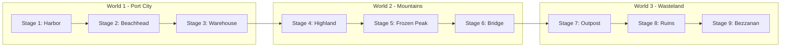
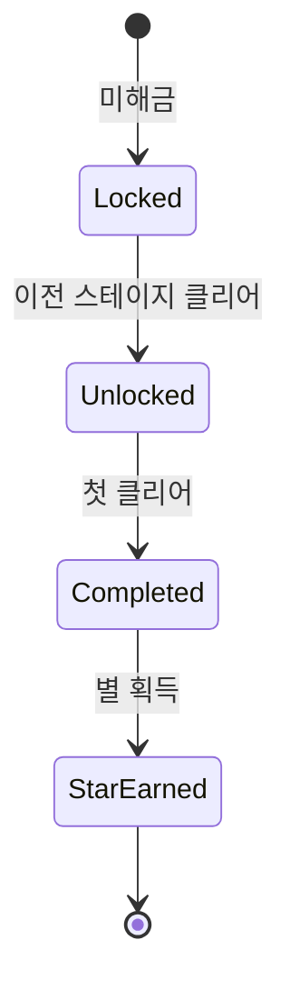

# 월드맵 시스템 기획 (World Map System Design) - Final Edition

> **버전**: 4.0 (Codex + Technical Reinforcement + Extended Systems + User Project Alignment)
> **참조**: Kingdom Rush 시리즈 분석, Unity 구현 최적화, 확장 시스템 설계
> **최종 수정**: 2026-02-13

---

## 1. 개요

### 1.1 비전
킹덤러시(Kingdom Rush)의 스타일을 계승하여, 플레이어가 스테이지를 선택하고 게임의 진행 상황을 파악하며 영구적인 성장을 관리하는 메인 허브로서의 월드맵을 설계한다.

### 1.2 핵심 목표
- **플레이어 진행도 시각화**: 현재 위치와 목표를 명확히 표시
- **전략적 선택**: 난이도별 보상 차이로 인한 의미 있는 플레이 결정 유도
- **재플레이 가치**: 별 획득 및 업그레이드 시스템으로 반복 플레이 자극
- **캐릭터/영웅 성장**: 영웅 시스템으로 플레이어 투자 심화
- **확장 콘텐츠**: 업적, 빌런, 레이드 시스템으로 장기 게임 가치 창출

### 1.3 Kingdom Rush 레퍼런스 분석 및 적용

| 요소 | Kingdom Rush | 본 프로젝트 적용 |
|------|--------------|------------------|
| 노드 스타일 | 손으로 그린 톤 스프라이트 | 2D 카툰 스타일 + 시네마틱 연출 |
| 난이도 구조 | 3단계 (Normal/Heroic/Iron) | 동일 구조 유지 (Casual/Normal/Veteran + Challenge Modes) |
| 별 시스템 | 1-3개 + 숨겨진 목표 | 동일 + 추가 도전 과제 |
| 업그레이드 | 타워별 스킬 트리 | 별 소모 글로벌 스킬 트리 |
| 영웅 시스템 | 스테이지별 선택 + 레벨업 | 동일 + 스킨/커스터마이징 |

---

## 2. 시각적 스타일 및 테마

### 2.1 아트 스타일
- **2D 카툰(만화) 스타일**: 벡터 아트웍 느낌의 깔끔하고 아기자기한 디자인.
- **반응형 UI**: 터치/마우스 인터랙션에 대한 시각적 피드백 (Tweening 활용).
- **애니메이션**: 상태 전환 시 부드러운 모션 (점프, 페이드, 깃발 꽂기).

### 2.2 월드 구성 및 구현 전략

**[Technical Implementation]**
- **Parallax Background**: 깊이감을 위해 3개 레이어로 분리 (근경, 중경-경로, 원경).
- **Camera System**: Orthographic 카메라 사용. `CameraClamp` 기능으로 맵 경계(Bounds) 이탈 방지.



| 월드 | 이름 | 테마 | 특징 |
|------|------|------|------|
| 1 | 항구 도시 | 평화로운 숲/초원 | 튜토리얼 및 초기 성장 |
| 2 | 산맥 및 설원 | 험난한 지형 | 중반 도전 |
| 3 | 황무지 | 어둡고 메마른 | 최종 보스 지역 |

### 2.3 리소스 경로 (Common Library Guidelines 준수)
- **UI Prefabs**: `Assets/Resources/UI/WorldMap/` (UIManager 자동 로드 지원)
- **Sprites**: `Assets/Resources/UI/Sprites/WorldMap/`
- **Backgrounds**: `Assets/Resources/WorldMap/Backgrounds/`

---

## 3. 구조 및 기능

### 3.1 맵 탐색 및 스테이지 선택

#### 3.1.1 스크롤/드래그
- **구현**: Unity `ScrollRect`를 활용하되, 관성(Inertia)을 킹덤러쉬 특유의 느낌으로 튜닝.
- **Raycast Target**: 맵 배경은 터치를 받아야 하므로 Raycast Target 활성화.

#### 3.1.2 스테이지 노드 (StageNode)



**[Component Design: `StageNode.cs`]**
- **State Pattern**: `Locked`, `Unlocked`, `Completed` 상태에 따라 스프라이트 교체.
- **Event**: `OnClick` 시 `StageInfoPopup` 호출.

### 3.2 스테이지 정보 팝업

#### 3.2.1 UI 구조
- **Base**: `Common.UI.BasePopup` 상속.
- **Data Binding**: 선택된 `StageConfig` 데이터를 받아 UI 갱신.

#### 3.2.2 난이도 및 모드

| 모드 | 조건 | 설명 | 보상 |
|------|------|------|------|
| **Campaign** | 기본 | Casual/Normal/Veteran 선택 | 별 1~3개 |
| **Heroic** | 별 3개 | 엘리트 적, 웨이브 변경 | 추가 별 |
| **Iron** | 별 3개 | 타워 제한 등 하드코어 | 도전 보상 |

### 3.3 업그레이드 시스템

#### 3.3.1 별(Star) 재화 관리
- **전역 관리**: `GameManager.Instance.User.Stars`로 접근.
- **Reset 기능**: 별 투자 내역을 초기화하고 포인트를 반환하는 로직 필수.

#### 3.3.2 스킬 트리 구조
- **UI 구성**: 탭 방식이 아닌, 책을 펴는 듯한 UI 또는 단일 화면 내 탭 전환.

---

## 4. 확장 시스템 (Extended Systems)

### 4.1 업적 시스템 (Achievements)
- **종류**: 진행형(누적), 완료형(단발), 시즌/한정.
- **보상**: 별, 재화, 배지, 칭호.

### 4.2 빌런/라이벌 시스템
- **Boss Stages**: 각 월드의 마지막 스테이지.
- **Rival Events**: 특정 조건 만족 시 등장하는 중간 보스 이벤트.

### 4.3 레이드/협동 전투 (Future Plan)
- **협동 레이드**: 다중 플레이어 또는 AI 파티와 함께 거대 보스 공략.

### 4.4 일일/주간 도전
- **Daily**: 간단한 미션 (예: 적 100마리 처치).
- **Weekly**: 복합 미션 (예: 특정 타워만으로 스테이지 클리어).

---

## 5. 데이터 구조 (Technical Specifications)

Design 데이터(변하지 않는 정보)와 User Data(변하는 정보)를 철저히 분리한다.

### 5.1 StageConfig (ScriptableObject)
기획 데이터는 에셋 형태로 관리하여 디자이너가 Inspector에서 수정 용이하게 함.

```csharp
using UnityEngine;

[CreateAssetMenu(fileName = "StageConfig", menuName = "Kingdom/StageConfig")]
public class StageConfig : ScriptableObject
{
    public string stageId;          // 고유 ID (예: "stage_1_1")
    public string stageName;        // 표시 이름
    public int worldId;             // 월드 ID
    public Sprite icon;             // 맵상 아이콘
    public Sprite thumbnail;        // 팝업용 썸네일
    [TextArea]
    public string description;      // 스토리 텍스트
    public string sceneName;        // 로드할 씬 이름
    
    [Header("Unlocks")]
    public string[] nextStageIds;   // 클리어 시 해금될 다음 스테이지들
}
```

### 5.2 UserSaveData (Serializable)
실제 파일로 저장되는 유저의 진행 상황 데이터. `GameManager`를 통해 접근 및 저장.

```csharp
[System.Serializable]
public class UserSaveData
{
    public int totalStars;              // 총 획득 별
    public List<string> clearedStages;  // 클리어한 스테이지 ID 목록
    public Dictionary<string, StageClearInfo> stageProgress; // 스테이지별 세부 기록
}

[System.Serializable]
public class StageClearInfo
{
    public int stars;        // 획득 별 (0-3)
    public bool isHeroicClear;
    public bool isIronClear;
    public float bestTime;   // 베스트 클리어 타임
    public int attempts;     // 시도 횟수
}
```

### 5.3 AchievementSaveData

```csharp
[System.Serializable]
public class AchievementSaveData
{
    public Dictionary<string, AchievementProgress> progress;
    public List<string> completedAchievements;
}

[System.Serializable]
public class AchievementProgress
{
    public int currentValue;
    public bool isCompleted;
    public bool isClaimed;
    public long lastUpdated;
}
```

---

## 6. UI 레이아웃 & 아키텍처

### 6.1 화면 구성
`Canvas` - `WorldMapPanel` (BaseWidget 상속)
  - `ScrollRect` (Content: MapImage)
    - `Background Layer` (Parallax)
    - `Path Layer` (Line Renderers)
    - `Node Layer` (StageNode Prefabs)
  - `HUD Layer` (Anchor: Stretch/Top, Stretch/Bottom)
    - `TopBar`: 별 개수, 설정, 프로필
    - `BottomBar`: 업그레이드, 영웅, 업적, 상점

### 6.2 코드 아키텍처

| 컴포넌트 | 경로 (`Assets/Scripts/Kingdom/WorldMap/`) | 역할 |
|----------|-------------------------------------------|------|
| `WorldMapManager` | `WorldMapManager.cs` | 전체 월드맵 상태 관리, 데이터 로드/저장 중계 |
| `StageNode` | `StageNode.cs` | 개별 노드 표시, 상태 변경, 클릭 이벤트 |
| `WorldMapUI` | `UI/WorldMapUI.cs` | HUD 및 스크롤 뷰 제어 |
| `StageInfoPopup` | `UI/StageInfoPopup.cs` | 스테이지 상세 정보 및 전투 시작 |

---

## 7. 체크리스트

### 7.1 필수 기능 (Required) - Phase 1 & 2

| 항목 | 설명 | 우선순위 |
|------|------|----------|
| 월드맵 스크롤 | 드래그로 맵 탐색 (Inertia 튜닝) | P0 |
| 스테이지 노드 | 상태별 스프라이트 표시 및 클릭 이벤트 | P0 |
| 노드 정보 팝업 | 스테이지 정보 표시 및 시작 버튼 | P0 |
| 씬 전환 | `SceneSwitcher`를 이용한 게임 씬 이동 | P0 |
| 별 저장/표시 | 획득 별 누적 및 UI 표시 | P0 |
| 노드 해금 로직 | 이전 스테이지 클리어 시 자동 해금 | P0 |
| 저장/불러오기 | `UserSaveData` JSON 저장/로드 | P0 |

### 7.2 권장 기능 (Recommended) - Phase 3 & 4

| 항목 | 설명 | 우선순위 |
|------|------|----------|
| Heroic/Iron 모드 | 고난도 스테이지 모드 선택 UI | P1 |
| 업그레이드 | 별 소비 스킬 트리 시스템 | P1 |
| 영웅 선택 | 영웅 배치 및 성장 시스템 | P1 |
| 업적 시스템 | 배지 및 보상 획득 | P2 |
| 빌런 시스템 | 스토리 보스 등장 연출 | P2 |

---

## 8. 개발 로드맵

### Phase 1: 핵심 시스템 (Foundation)
1. **데이터 에셋**: `StageConfig` SO 정의 및 1월드 데이터 생성.
2. **월드맵 씬**: 배경 배치, 카메라/스크롤 시스템 구현.
3. **노드 시스템**: `StageNode` 프리팹 제작 및 상태 기반 스프라이트 교체.

### Phase 2: UI 및 인터랙션 (Interaction)
4. **팝업 시스템**: `StageInfoPopup` 구현 (Common `BasePopup` 활용).
5. **씬 전환**: `GameManager` 및 `SceneSwitcher` 연동.
6. **저장 연동**: `UserSaveData` 구조체 구현 및 파일 IO 테스트.

### Phase 3: 게임플레이 통합 (Gameplay Integration)
7. **클리어 복귀**: 게임 승리/패배 후 월드맵 복귀 시 연출.
8. **경로 연출**: 스테이지 클리어 시 다음 스테이지로 이어지는 점선 애니메이션.
9. **별 시스템**: 획득 별 계산 및 저장 로직.

### Phase 4: 확장 콘텐츠 (Expansion)
10. **업그레이드/영웅**: UI 및 로직 구현.
11. **업적/빌런**: 추가 재미 요소 구현.

---

**문서 종료**
