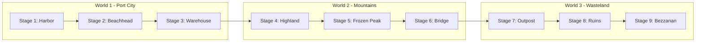
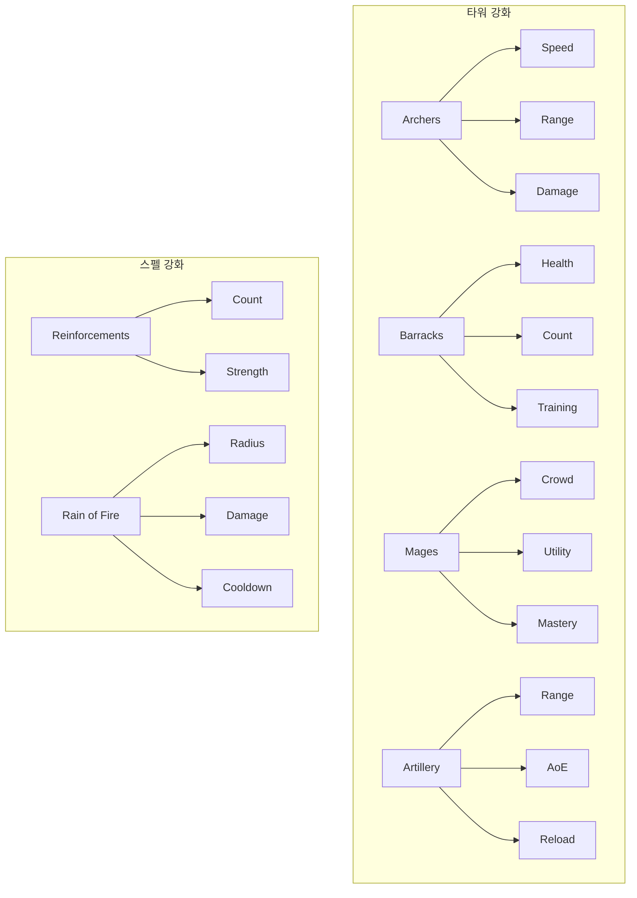
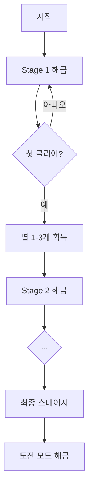

# 월드맵 시스템 기획 (World Map System Design) - CODEX Edition

> **버전**: 1.0  
> **참조**: Kingdom Rush 시리즈 분석 기반  
> **최종 수정**: 2026-02-13

---

## 1. 개요

### 1.1 비전
킹덤러시(Kingdom Rush)의 스타일을 계승하여, 플레이어가 스테이지를 선택하고 게임의 진행 상황을 파악하며 영구적인 성장을 관리하는 메인 허브로서의 월드맵을 설계한다.

### 1.2 핵심 목표
- **플레이어 진행도 시각화**: 현재 위치와 목표를 명확히 표시
- **전략적 선택**: 난이도별 보상 차이로 인한 의미 있는 플레이 결정 유도
- **재플레이 가치**: 별 획득 및 업그레이드 시스템으로 반복 플레이 자극
- **캐릭터/영웅 성장**: 영웅 시스템으로 플레이어 투자 심화

---

## 2. 시각적 스타일 및 테마

### 2.1 아트 스타일
- **2D 카툰(만화) 스타일**: 벡터 아트웍 느낌의 깔끔하고 아기자기한 디자인
- **반응형 UI**: 터치/마우스 인터랙션에 대한 시각적 피드백
- **애니메이션**: 상태 전환 시 부드러운 모션 (점프, 페이드, 깃발 꽂기)

### 2.2 월드 구성



| 월드 | 이름 | 테마 | 특징 |
|------|------|------|------|
| 1 | 항구 도시 | 평화로운 숲/초원 | 튜토리얼 및 초기 성장 |
| 2 | 산맥 및 설원 | 험난한 지형 | 중반 도전 |
| 3 | 황무지 | 어둡고 메마른 | 최종 보스 지역 |

### 2.3 맵 요소
- **경로 표현**: 점선 경로로 연결하여 진행 방향 명확히 표시
- **클리어 마커**: 깃발 꽂힘 애니메이션
- **숨겨진 경로**: 특정 조건(별 3개 달성)에서만 나타나는 추가 스테이지

---

## 3. 구조 및 기능

### 3.1 맵 탐색 및 스테이지 선택

#### 3.1.1 스크롤/드래그
- 화면보다 큰 맵을 드래그하여 이동
- 현재 위치 표시 (플레이어 커서 또는 하이라이트)
- 양쪽/위아래 가장자리에서 경로 이탈 방지

#### 3.1.2 스테이지 노드 상태

```mermaid
stateDiagram-v2
    [*] --> Locked : 미해금
    Locked --> Unlocked : 이전 스테이지 클리어
    Unlocked --> Completed : 첫 클리어
    Completed --> StarEarned : 별 획득
    StarEarned --> [*]
    
    state Locked {
       灰色アイコン
        施錠表示
    }
    
    state Unlocked {
        地形アイコン
        タップで情報
    }
    
    state Completed {
        獲得した星1-3個
        旗アニメーション
    }
```

| 상태 | 시각적 표현 | 인터랙션 |
|------|-------------|----------|
| 잠금 | 회색 아이콘 + 자물쇠 | 불가 (반투명) |
| 해금 | 스테이지 테마 아이콘 | 클릭 → 정보 팝업 |
| 클리어 | 획득한 별(1~3개) + 깃발 | 클릭 → 정보 팝업 |
| 도전 해금 | 별 3개 획득 시 추가 아이콘 | 활성화 |

### 3.2 스테이지 정보 팝업

#### 3.2.1 기본 정보
- **제목**: 스테이지 이름
- **설명**: 간단한 스토리 텍스트
- **미리보기**: 미니 맵 또는 주요 타워 배치 힌트

#### 3.2.2 난이도 및 모드

| 모드 | 조건 | 설명 | 보상 |
|------|------|------|------|
| **Campaign** | 기본 | Casual/Normal/Veteran 선택 | 별 1~3개 |
| **Heroic** | 별 3개 | 엘리트 적, 웨이브 변경 | 추가 별 |
| **Iron** | 별 3개 | 타워 제한 등 하드코어 | 도전 보상 |

#### 3.2.3 모드별 세부 설정

**Campaign 모드 난이도:**
- **Casual**: 방어 타워 50% 할인, 적 약화
- **Normal**: 표준 설정
- **Veteran**: 적 강화, 자원 감소

**도전 모드:**
- **Heroic**: Elite enemy spawn, modified wave composition
- **Iron**: 특정 타워 금지, 체력 제한 등

### 3.3 업그레이드 시스템

#### 3.3.1 별(Star) 재화
- **획득**: 스테이지 클리어 등급에 따라 (최대 3개)
- **사용**: 스킬 트리 투자
- **특징**: 언제든 회수하여 재투자 가능 (전략적 유연성)

#### 3.3.2 스킬 트리 구조



| 트랙 | 레벨 1 | 레벨 2 | 레벨 3 |
|------|--------|--------|--------|
| **Archers** | 기본 궁수 | 사거리 확장 | 연사 속도 |
| **Barracks** | 기본 병영 | 병사 수 증가 | 훈련 보너스 |
| **Mages** | 기본 마법사 | 범위 공격 | 유틸리티 |
| **Artillery** | 기본 포병 | 사거리 확장 | 광역 피해 |

### 3.4 영웅 시스템

#### 3.4.1 영웅 선택
- **기본 영웅**: 게임 시작 시 1개 제공
- **해금**: 캠페인 진행도에 따라 추가 영웅 해금
- **선택**: 출전할 영웅 1명 선택

#### 3.4.2 영웅 성장

| 성장 요소 | 설명 | 획득 방법 |
|-----------|------|-----------|
| **레벨업** | 기본 스탯 증가 | 전투 경험치 |
| **스킬 포인트** | 액티브/패시브 스킬 강화 | 레벨업 |
| **아이템** | 장비插槽 | 상점/보상 |

#### 3.4.3 영웅 해금 조건

| 영웅 | 해금 조건 | 특징 |
|------|-----------|------|
| Hero A | Stage 1 클리어 | 균형형 |
| Hero B | Stage 3 클리어 | 공격형 |
| Hero C | Stage 5 클리어 | 방어형 |
| Hero D | Stage 7 클리어 | 지원형 |

---

## 4. 진행 및 해금 메커니즘

### 4.1 기본 진행 흐름



### 4.2 타워 해금 순서

| 레벨 | 타워 | 해금 조건 | 비고 |
|------|------|-----------|------|
| 1 | Archer, Barracks, Mage, Artillery | 기본 | - |
| 2 | Archer Lv.2 | Stage 2 클리어 | 스킬 트리 해금 |
| 3 | Barracks Lv.2 | Stage 3 클리어 | 스킬 트리 해금 |
| 4 | Mage Lv.2 | Stage 4 클리어 | 스킬 트리 해금 |
| 5 | Artillery Lv.2 | Stage 5 클리어 | 스킬 트리 해금 |
| SP | Special Tower | Stage 6 클리어 | 보스 전용 |

### 4.3 도전 모드 해금 조건
- **Heroic Mode**: 해당 스테이지 별 3개 획득 시
- **Iron Mode**: 해당 스테이지 별 3개 획득 시
- **Hidden Stage**: 전체 별 30개 이상 + 특정 조건

---

## 5. UI 레이아웃

### 5.1 화면 구성

```
┌─────────────────────────────────────┐
│  [별 아이콘 x12]  [설정] [상점]      │  ← 상단
├─────────────────────────────────────┤
│                                     │
│         🌊🌲 맵 영역 🌲🏔️           │
│                                     │
│           📍 현재 위치              │
│                                     │
├─────────────────────────────────────┤
│  [업그레이드]  [영웅]  [백과사전]   │  ← 하단
└─────────────────────────────────────┘
```

### 5.2 상단 UI
- **별 개수**: 현재 보유 별 표시 (아이콘 + 숫자)
- **설정 버튼**: 옵션 메뉴
- **상점 버튼**: 소모성 아이템 (선택 사항)

### 5.3 하단 UI
| 버튼 | 기능 | 비고 |
|------|------|------|
| 업그레이드 | 스킬 트리 | 별 소비 |
| 영웅 | 영웅 선택/성장 | 레벨, 스킬 |
| 백과사전 | 적/타워 정보 | 도감 |
| 상점 | 아이템 구매 | 선택 사항 |

---

## 6. 확장 시스템 (CODEX 추가)

### 6.1 업적 시스템

| 업적명 | 조건 | 보상 |
|--------|------|------|
| **첫 승리** | Stage 1 클리어 | 별 x1 |
| **별 수집가** | 총 별 30개 획득 | 타이틀 |
| **완벽주의** | 모든 스테이지 별 3개 | 특별 영웅 |
| **시간 공격** | Stage X를 5분 이내 클리어 | 배지 |

### 6.2 빌런/라이벌 시스템
- **스테이지 보스**: 각 월드 최종 스테이지
- **라이벌 캐릭터**: 스토리라인상의 적将领
- **승리 보상**: 스토리 진행 + 특별 보상

### 6.3 레이드/협동 전투 (v2 확장)
- **多人 모드**:協力プレイ対応
- **공성전**: 다수의 플레이어가 협력하여 방어

### 6.4 일일/주간 도전
- **일일 퀘스트**: 추가 별 획득 기회
- **주간 보상**: 로그인 보너스

---

## 7. 데이터 구조

### 7.1 StageData

```csharp
[System.Serializable]
public class StageData
{
    public string stageId;          // 고유 ID
    public string stageName;         // 표시 이름
    public int worldId;              // 월드 ID
    public int order;                // 순서
    public StageState state;         // 상태
    public int stars;                // 획득한 별 (0-3)
    public int heroicStars;          // Heroic 별
    public int ironStars;            // Iron 별
    public UnlockCondition unlock;   // 해금 조건
}

public enum StageState
{
    Locked,      // 잠금
    Unlocked,    // 해금
    Completed    // 클리어
}
```

### 7.2 PlayerProgress

```csharp
[System.Serializable]
public class PlayerProgress
{
    public int totalStars;              // 총 별
    public int spentStars;               // 사용 별
    public List<string> unlockedStages; // 해금된 스테이지
    public List<string> completedStages; // 클리어된 스테이지
    public HeroProgress[] heroes;       // 영웅 진행도
    public AchievementProgress[] achievements; // 업적
}
```

---

## 8. 개발 로드맵

### Phase 1: 핵심 시스템
1. **맵 데이터 구조 설계**: `StageData`, `PlayerProgress` 정의
2. **월드맵 씬 구성**: 배경 이미지 배치 및 스크롤 기능
3. **스테이지 노드 프리팹**: 상태별 비주얼 처리
4. **UI 연동**: 스테이지 정보 팝업

### Phase 2: 게임플레이 통합
5. **저장 시스템**: JSON/Binary로 진행도 저장/로드
6. **전투 씬 연동**: 월드맵 → 게임 씬 전환
7. **결과 화면**: 별 획득 애니메이션 및 저장

### Phase 3: 확장 기능
8. **도전 모드**: Heroic/Iron 모드 구현
9. **업그레이드 시스템**: 스킬 트리 UI 및 로직
10. **영웅 시스템**: 영웅 선택 및 성장

### Phase 4: 추가 콘텐츠
11. **업적 시스템**: 배지 및 보상
12. **숨겨진 스테이지**: 보너스 콘텐츠
13. **백과사전**: 적/타워 도감

---

## 9. 체크리스트

### 필수 기능
- [ ] 맵 스크롤/드래그
- [ ] 스테이지 노드 상태 표시 (잠금/해금/클리어)
- [ ] 별 1~3개 획득 시스템
- [ ] 스테이지 정보 팝업
- [ ] 난이도 선택 (Casual/Normal/Veteran)
- [ ] 도전 모드 (Heroic/Iron)
- [ ] 스킬 트리
- [ ] 영웅 선택 및 성장
- [ ] 저장/로드 시스템

### 권장 기능
- [ ] 업적 시스템
- [ ] 숨겨진 스테이지
- [ ] 빌런 시스템
- [ ] 일일/주간 도전
- [ ] 협동 전투 (v2)

---

## 10. 참고 자료

- **Kingdom Rush Origins**: 아트 스타일 참고
- **Kingdom Rush Vengeance**: 빌런 시스템 참고
- **Kingdom Rush Frontiers**: 월드 확장 참고

---

> **문서 종료**
