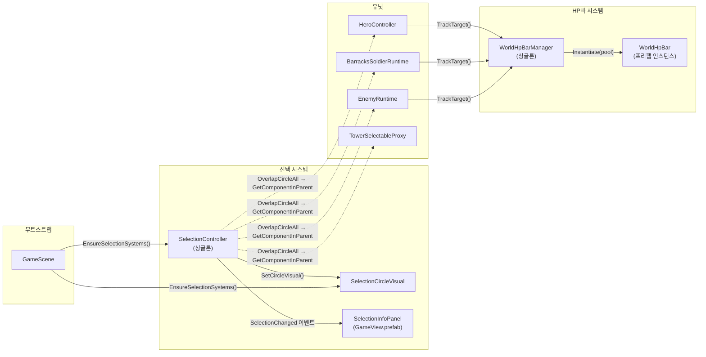

# SelectionSystem 프리팹 전환 및 HP바 안정화 계획 (2026-02-22)

## 배경

### 현재 시스템 상태
- `SelectionController`, `SelectionCircleVisual`은 `GameScene.EnsureSelectionSystems()`에서 **런타임 동적 생성**에 전적으로 의존.
- `WorldHpBarManager`는 `GameScene.EnsureWorldHpBarSystem()`에서 런타임 생성 + `Resources.Load("UI/WorldHpBar")`로 프리팹을 주입하는 **부트스트랩 경로가 이미 존재**.
- 다만, `WorldHpBar.prefab`의 `Fill` SpriteRenderer 바인딩이 직렬화로 확정되지 않아 `ResolveFillRenderer()` 런타임 탐색에 의존.
- `WorldHpBar`가 `SpriteRenderer` 기반이면서 `CanvasGroup.alpha`로 투명도를 제어하려는 **기술 부채**(CanvasGroup은 UI 전용으로 SpriteRenderer에 영향 없음)가 존재.

### 해결된 이슈 (경위 요약)
| 시간 | 이슈 | 조치 |
|------|------|------|
| 14:14 | 유닛에 `Collider2D` 없어 클릭 미탐지 | 적/타워/병사/영웅 생성 시 `CircleCollider2D(isTrigger)` 추가 |
| 14:14 | `TowerRuntime`이 `MonoBehaviour`가 아니라 `GetComponentInParent` 불가 | `TowerSelectableProxy : MonoBehaviour, ISelectableTarget` 프록시 추가 |
| 14:14 | `SelectionController.LayerMask` 미설정 시 선택 불가 | 값이 0이면 `Physics2D.AllLayers`로 fallback |
| 14:18 | `SelectionInfoPanel` placeholder Image가 입력 차단 | `DisablePlaceholderImagesAndRaycasts()` 추가 |
| 14:23 | `SelectionController` 자체가 씬에 없어 전체 미동작 | `GameScene.EnsureSelectionSystems()` 런타임 생성 추가 |

### 잔여 리스크
- **Selection**: 런타임 동적 생성은 직렬화 참조 불가, Inspector 튜닝 불가, 실행 순서 불안정 등의 한계가 있음.
- **HP바 프리팹**: `WorldHpBar.prefab`의 `_fillRenderer` 직렬화 바인딩이 미확정 → 매 인스턴스 `ResolveFillRenderer()` 런타임 탐색 수행.
- **CanvasGroup 기술 부채**: `WorldHpBar`가 `SpriteRenderer`로 렌더링하면서 `CanvasGroup.alpha`를 사용 중. `CanvasGroup`은 `Canvas` 하위 UI 오브젝트에만 영향을 미치므로 현재 투명도 제어가 사실상 **무동작** 상태.
- **선택-타워 클릭 충돌**: `GameScene.Update()`의 `TryFindTowerAtWorldPosition()`과 `SelectionController.HandleMouseClick()`이 동일 마우스 클릭에 각각 반응하여 타워 클릭 시 타워 액션 메뉴와 선택 시스템이 동시 활성화될 수 있음.
- HP바 위치/감소 방향의 UX 파라미터가 코드 상수로 되어 있어 Inspector에서 조정 불가.

---

## 목표
1. Selection 시스템을 **프리팹 기반**으로 전환하여 직렬화 참조와 Inspector 튜닝을 가능하게 함.
2. HP바를 **프리팹 기준으로 안정 동작**(항상 표시, 좌측 고정 감소, 머리 위 위치)하도록 고정.
3. 런타임 fallback은 **안전망으로만 유지**하고, 정상 경로에서는 프리팹 로드를 사용.

---

## 범위
- **포함**:
  - `SelectionSystem.prefab` 신설 및 `GameScene` 연결
  - `SelectionCircleVisual` 리소스 의존 축소 (직렬화 우선)
  - `WorldHpBar.prefab` 구조/컴포넌트 정합성 고정
  - `WorldHpBarManager` 부트스트랩 경로 `GameScene`에 추가
  - 선택/HP바 동작 회귀 검증
- **제외**:
  - 타입별 고급 스타일링(색상/애니메이션 분기) 대규모 리디자인
  - `SelectionInfoPanel` 레이아웃 비주얼 개편 (현재 구조 유지)

---

## 현재 코드 의존 관계도



---

## 구현 계획

### Phase 1. Selection 프리팹 자산화

#### 목적
런타임 동적 생성 의존을 제거하고, Inspector에서 직렬화 참조/파라미터 튜닝이 가능하도록 함.

#### 변경 사항

| 대상 | 작업 |
|------|------|
| `Assets/Resources/UI/SelectionSystem.prefab` [신규] | 아래 구조로 생성 |
| `GameScene.EnsureSelectionSystems()` | 프리팹 로드 우선, 실패 시 기존 fallback 유지 |

#### 프리팹 구조
```
SelectionSystem (GameObject)
├── SelectionController (Component)
│   ├── _selectionLayer: Default (0 = AllLayers fallback 활용)
│   ├── _clickRadius: 0.5
│   └── _circleVisual: → 자식 SelectionCircleVisual 참조
└── SelectionCircleVisual (Child GameObject)
    ├── SelectionCircleVisual (Component)
    │   └── _circleSprite: → Resources/UI/Sprites/Common/SelectionCircle.png
    └── SpriteRenderer
        └── sortingOrder: 30
```

#### 핵심 주의 사항
- `SelectionController._circleVisual`은 **프리팹 내부 참조**로 직렬화 연결해야 함 (외부 에셋 참조 아님).
- `SelectionCircleVisual`의 `DefaultCircleSpritePath` Resources.Load fallback은 유지하되, 프리팹에서 직접 바인딩이 정상 경로.
- `SelectionController.Awake()`의 싱글톤 중복 방어(`Instance != this → Destroy`)는 그대로 유지.
- **선택-타워 클릭 충돌**: `GameScene.Update()`에서 타워/빈슬롯을 먼저 감지 → 링/액션 메뉴 열기 → `return`으로 클릭 소비. `SelectionController.Update()`도 동일 프레임에 `Input.GetMouseButtonDown(0)`을 감지하므로, 타워 위를 클릭하면 **양쪽이 동시 반응**할 수 있음. 이를 방지하려면 `SelectionController`에서 타워 레이어를 제외하거나, `GameScene`이 타워 클릭을 소비한 뒤 `SelectionController`에 플래그를 전달하는 방식이 필요.

---

### Phase 2. GameScene 부트스트랩 정리

#### 변경 사항

| 대상 | 작업 |
|------|------|
| `GameScene.EnsureSelectionSystems()` | `Resources.Load("UI/SelectionSystem")` 프리팹 로드 → `Instantiate` 우선 |
| (동일) | 로드 실패 시에만 기존 `new GameObject` fallback 경로 유지 |
| `GameScene.EnsureWorldHpBarSystem()` | 기존 코드 유지 (이미 존재). Phase 3에서 프리팹 정합만 보장 |

#### 의사 코드
```csharp
// 1차: 프리팹 로드
GameObject prefab = Resources.Load<GameObject>("UI/SelectionSystem");
if (prefab.IsNotNull())
{
    GameObject instance = Instantiate(prefab);
    _selectionController = instance.GetComponent<SelectionController>();
    _selectionCircleVisual = instance.GetComponentInChildren<SelectionCircleVisual>();
}

// 2차: fallback (프리팹 없을 때만)
if (_selectionController.IsNull())
{
    // 기존 런타임 생성 코드 유지
}
```

#### 핵심 주의 사항
- 프리팹 인스턴스는 `DontDestroyOnLoad` 불필요 (GameScene은 전투 씬 한정).
- 기존 `FindFirstObjectByType` 확인 로직은 제거하고, 프리팹 인스턴스의 컴포넌트를 직접 참조.

---

### Phase 3. HP바 프리팹 정합성 확정

#### 현재 문제
- `WorldHpBar.prefab`의 루트에 `WorldHpBar` 컴포넌트가 있는지, `Fill` 자식의 `SpriteRenderer`가 `_fillRenderer`에 직렬화 연결되어 있는지 **미확인 상태**.
- `GameScene.EnsureWorldHpBarSystem()`은 이미 구현되어 있으나, 프리팹 자체의 직렬화 바인딩이 불완전하면 `ResolveFillRenderer()` 런타임 탐색 경로를 매번 타게 됨.
- `WorldHpBar`가 `CanvasGroup.alpha = 1f`를 매 프레임 설정하지만, `SpriteRenderer` 기반이므로 **실질적 효과 없음** → 제거 또는 `SpriteRenderer.color` 방식으로 교체 필요.

#### 변경 사항

| 대상 | 작업 |
|------|------|
| `WorldHpBar.prefab` | `WorldHpBar` 컴포넌트 확인/고정, `Fill` SpriteRenderer `_fillRenderer` 직렬화 연결 |
| `WorldHpBarManager` | `ConfigureRuntime()` 호출 경로 확보 (GameScene 또는 프리팹 직렬화) |
| `GameScene` | `WorldHpBarManager` 존재 확인 + prefab 주입 로직 추가 |

#### 프리팹 구조 확정
```
WorldHpBar (GameObject)
├── WorldHpBar (Component)
│   ├── _fillRenderer: → 자식 Fill의 SpriteRenderer
│   └── _offset: (0, 0.08, 0)
├── SpriteRenderer (Background - 어두운 색)
└── Fill (Child GameObject)
    └── SpriteRenderer (Fill - 밝은 색, 녹색 계열)
```

> **CanvasGroup 처리 방침**: 기존 코드의 `CanvasGroup` 추가/참조 로직은 제거한다.
> 향후 HP바 점멸/페이드 연출이 필요하면 `SpriteRenderer.color.a`를 조작하는 방식으로 대체한다.

#### 핵심 주의 사항
- `WorldHpBar.ResolveFillRenderer()`는 직렬화 미연결 시의 **안전망**이므로 삭제하지 않음.
- `_offset.y` 가드(`> 0.3f → 0.08f`)는 이전 값(0.5f)이 프리팹에 저장된 경우를 대비한 것이므로, 프리팹 정합성 확정 후에도 한동안 유지.
- `WorldHpBarManager.Awake()`에서 `_hpBarPrefab`이 null이면 풀 생성을 건너뛰므로, **반드시 프리팹 직렬화 또는 `ConfigureRuntime()` 중 하나로 주입**해야 함.

---

### Phase 4. UX 파라미터 확정

#### HP바 파라미터

| 항목 | 현재 값 | 비고 |
|------|---------|------|
| `_offset` | `(0, 0.08, 0)` | `ResolveHeadAnchorWorldPosition()`이 머리 위를 자동 계산하므로, 이 값은 **미세 보정용** |
| `extra` (머리 위 여백) | `Clamp(0.06 + height*0.04, 0.06, 0.18)` | Collider/SpriteRenderer bounds 기반 자동 산출 |
| 좌측 고정 감소 | `shiftX = (original - scaled) * 0.5` | localPosition.x 보정으로 왼쪽 끝 고정 |
| 표시 정책 | `SetActive(true)` (타겟 살아있으면 항상) | 별도 alpha 제어 없음 (CanvasGroup 제거 후) |

> **튜닝 포인트**: `_offset.y`와 `extra` 계산식의 상수 값은 실기동 확인 후 미세 보정 필요.
> 필요 시 `_offset`을 `[Range]` 어트리뷰트로 Inspector 슬라이더화 검토.

#### 선택 원 파라미터

| 항목 | 현재 값 | 비고 |
|------|---------|------|
| 유닛 타입별 기본 직경 | Tower: 1.35, Hero: 0.95, Soldier/Enemy: 0.82 | `ResolveDesiredWorldDiameter()` fallback |
| Collider 기반 산출 | `max(bounds.x, bounds.y) * 1.25` | Collider 있을 때 동적 계산 |
| 스케일 Clamp | `(0.03, 2.5)` | 극단적 크기 방지 |
| Collider 기반 Clamp | `(0.55, 1.8)` | Collider bounds 기반 시 적용 |

> **튜닝 포인트**: 타워의 `CircleCollider2D.radius = 0.55`가 시각적 선택 원과 잘 맞는지 실기동 확인 필요.

#### CircleCollider2D 반경 현황

| 유닛 | radius | 비고 |
|------|--------|------|
| 적 (Enemy) | 0.35 | `SpawnManager` |
| 타워 (Tower) | 0.55 | `TowerManager.CreateTowerRuntime()` |
| 배럭 병사 | 0.32 | `TowerManager.TowerRuntime.EnsureSquad()` |
| 영웅 (Hero) | 0.38 | `HeroController.EnsureVisual()` |

---

### Phase 5. 회귀 검증

#### 수동 검증 시나리오

| # | 시나리오 | 기대 결과 |
|---|----------|-----------|
| 1 | 적 유닛 클릭 | 선택 원 표시 + 정보 패널 이름/HP 노출 |
| 2 | 타워 클릭 | `TowerSelectableProxy` 경유 선택 + 정보 패널 노출 |
| 3 | 배럭 병사 클릭 | 선택 원 표시 + 정보 패널 노출 |
| 4 | 영웅 클릭 | 선택 원 표시 + 정보 패널 노출 |
| 5 | 빈 공간 클릭 | 선택 해제 + 정보 패널 숨김 + 선택 원 숨김 |
| 6 | UI 버튼 클릭 | 월드 선택 무시 (`IsPointerOverGameObject` 가드) |
| 7 | 유닛 피격 시 | HP바 머리 위 표시 + 좌측 고정 감소 동작 |
| 8 | 유닛 사망 시 | HP바 사라짐 + 선택 상태 자동 해제 |
| 9 | 정보 패널이 입력 차단하지 않음 | placeholder Image raycast 비활성 확인 |

#### 빌드 검증
```bash
dotnet build Assembly-CSharp.csproj -v minimal
# 기대: 오류 0
```

---

## 수용 기준 (Acceptance Criteria)
1. `SelectionSystem.prefab`가 `Assets/Resources/UI/`에 존재하고, `GameScene` 시작 시 프리팹 경로로 로드되어 동작.
2. `WorldHpBar.prefab`의 `Fill` SpriteRenderer가 직렬화로 바인딩되어 있고, 런타임 `ResolveFillRenderer()` 경로를 타지 않음.
3. `WorldHpBarManager`에 `_hpBarPrefab`이 직렬화 또는 `ConfigureRuntime()`으로 정상 주입됨.
4. HP바 관련 치명 로그(`NullReferenceException`, 컴포넌트 누락 경고) 재발 없음.
5. 선택/HP UI가 모든 주요 유닛 타입(적/아군/영웅/타워)에서 동일하게 동작.

## 롤백 전략
- **Selection**: `GameScene`에서 프리팹 로드 경로를 비활성화하면 기존 런타임 생성 fallback이 즉시 동작.
- **HP바**: `WorldHpBar` 단일 파일 수정으로 위치/감소 방향 즉시 원복 가능.
- **전체**: 모든 변경은 기존 코드를 삭제하지 않고 분기하므로, fallback 경로 활성화만으로 즉시 복원.

## 산출물

### 코드 변경
| 파일 | 변경 유형 | 설명 |
|------|-----------|------|
| `Assets/Scripts/Kingdom/App/GameScene.cs` | 수정 | `EnsureSelectionSystems()`를 프리팹 우선 로드로 변경 |
| `Assets/Scripts/Kingdom/Game/UI/SelectionController.cs` | 유지 | 프리팹 전환에 따른 변경 없음 (이미 싱글톤 방어 포함) |
| `Assets/Scripts/Kingdom/Game/UI/SelectionCircleVisual.cs` | 유지 | Resources.Load fallback 유지, 프리팹에서 직렬화 우선 |
| `Assets/Scripts/Kingdom/Game/UI/WorldHpBar.cs` | **수정** | `CanvasGroup` 관련 코드 제거, `ResolveFillRenderer` 안전망은 유지 |
| `Assets/Scripts/Kingdom/Game/UI/WorldHpBarManager.cs` | 유지 | ConfigureRuntime 경로 이미 존재, `EnsureWorldHpBarSystem()`에서 호출 중 |

### 에셋 변경
| 파일 | 변경 유형 | 설명 |
|------|-----------|------|
| `Assets/Resources/UI/SelectionSystem.prefab` | 신규 | SelectionController + SelectionCircleVisual 프리팹 |
| `Assets/Resources/UI/WorldHpBar.prefab` | 수정 | Fill SpriteRenderer 직렬화 바인딩 확정 |

---

## 추가 보완 사항 (2026-02-22)

### 1) 완료 기준 수치화 (Definition of Done)

| 항목 | 기준 |
|------|------|
| 클릭 선택 성공률 | 30회 반복 클릭 기준 30/30 성공 (적/병사/영웅/타워 각 타입 포함) |
| 선택 해제 동작 | 빈 공간 클릭 시 100% 해제 |
| HP바 표시 | 대상 생성 후 0.2초 이내 표시 |
| HP 감소 연출 | 100%→0% 구간에서 좌측 고정 감소(우측만 축소) 확인 |
| 치명 로그 | `NullReferenceException`, `MissingReferenceException`, 컴포넌트 누락 경고 0건 |
| 성능 기준 | 화면 내 유닛 50개 기준 프레임 급락(평균 대비 25% 이상) 없음 |

### 2) 프리팹 정합 체크리스트 (배포 전 필수)

#### `SelectionSystem.prefab`
- [ ] Root에 `SelectionController` 컴포넌트 존재
- [ ] Child에 `SelectionCircleVisual` + `SpriteRenderer` 존재
- [ ] `SelectionController._circleVisual` 직렬화 참조 연결
- [ ] `SelectionCircleVisual._circleSprite` 직렬화 참조 연결
- [ ] SelectionCircle 렌더 `sortingOrder` 검증

#### `WorldHpBar.prefab`
- [ ] Root에 `WorldHpBar` 컴포넌트 존재
- [ ] Root에 `CanvasGroup` 미부착 확인 (제거 대상)
- [ ] Child `Fill`의 `SpriteRenderer`가 `_fillRenderer`에 연결
- [ ] Background/Fill 정렬 순서가 의도한 값인지 확인
- [ ] `_offset` 값이 운영 기준(현재 `y=0.08`)과 일치

### 3) Fallback/Fail-fast 정책 표준화

| 상황 | 1차 처리 | 2차 처리 | 최종 정책 |
|------|----------|----------|-----------|
| `SelectionSystem` 프리팹 로드 실패 | 경고 로그 | 런타임 생성 fallback | 전투 진행 허용 |
| `WorldHpBar` 프리팹 로드 실패 | 경고 로그 | HP바 기능 비활성 | 전투 진행 허용 |
| `WorldHpBar` 컴포넌트 누락 | 런타임 `AddComponent` | 경고 로그 | 전투 진행 허용 |
| `Fill` 바인딩 누락 | 이름/자식 탐색 | 탐색 실패 시 빈 바 유지 | 전투 진행 허용, 경고 로그 |
| `SelectionController` 중복 생성 | 추가 인스턴스 제거 | 싱글톤 유지 | 전투 진행 허용 |

### 4) 타입별 HP 위치 표준 (초안)

| UnitType | Anchor 기준 | 추가 보정값 |
|----------|-------------|-------------|
| Enemy | `max(Collider/Sprite).maxY` | `+0.02` |
| Soldier | `max(Collider/Sprite).maxY` | `+0.00` |
| Hero | `max(Collider/Sprite).maxY` | `+0.03` |
| Tower | `max(Collider/Sprite).maxY` | `+0.06` |

> 적용 방식: 공통 계산식 + `UnitType`별 추가 보정 테이블.  
> 목표: “항상 머리 위”를 유지하되, 타입별 비율 차이로 인한 과상단/과하단 편차 제거.

### 5) 자동 회귀 테스트 확장 계획

#### 자동화 대상
- [ ] 클릭 선택 회귀: 타입별 클릭/해제/중복 클릭
- [ ] HP바 회귀: 생성/표시/감소 방향/사망 시 제거
- [ ] UI 충돌 회귀: HUD 클릭과 월드 선택 상호 간섭 없음
- [ ] 로그 회귀: 치명 로그 0건 보장

#### 테스트 통과 기준
- [ ] 테스트 시나리오 전체 pass
- [ ] 플레이 중 예외 로그 0건
- [ ] 수동 스모크 1회(최소 1 wave) 추가 확인

### 6) 운영 로그 정책 (허용/차단)

| 레벨 | 분류 | 정책 |
|------|------|------|
| Error | Null/Missing/컴포넌트 누락 | 배포 차단 |
| Warning | fallback 작동 로그(일회성) | QA 허용, 배포 전 0건 권장 |
| Log | 상태 추적/디버그 | 개발 환경만 허용 |

#### 운영 규칙
- 빌드 직전 콘솔 기준 `Error 0`은 필수.
- `Warning`은 fallback 관련 항목을 우선 제거.
- 회귀 통과 후에도 동일 Warning 반복 발생 시 구조 수정 우선.

### 7) 기술 부채 목록

| ID | 항목 | 심각도 | 설명 |
|----|------|--------|------|
| TD-1 | `WorldHpBar`의 `CanvasGroup` 사용 | 중 | `SpriteRenderer` 기반 오브젝트에 `CanvasGroup.alpha`를 적용하고 있으나 실제 효과 없음. 제거 후 필요 시 `SpriteRenderer.color.a`로 대체. |
| TD-2 | 선택-타워 클릭 충돌 | 중 | `GameScene.Update()`와 `SelectionController.Update()`가 동일 프레임에 `GetMouseButtonDown(0)`을 독립 처리. 타워 클릭 시 양쪽이 동시 반응 가능. |
| TD-3 | `ResolveFillRenderer()` 런타임 탐색 | 저 | 프리팹 직렬화로 `_fillRenderer`가 바인딩되면 불필요하지만, 안전망으로 잔존. 프리팹 정합 확인 후 `[Obsolete]` 마킹 검토. |
| TD-4 | `_offset.y` 가드 상수 | 저 | `Awake()`에서 `_offset.y > 0.3f → 0.08f`로 강제 보정하는 로직. 프리팹 값 고정 후 가드 해제 가능하나 당분간 유지. |

### 8) 선택-타워 클릭 충돌 해결 방안 (초안)

현재 타워 클릭 시 `GameScene`과 `SelectionController` 양쪽에서 동시에 반응하는 문제에 대한 해결 옵션:

| 방안 | 설명 | 장점 | 단점 |
|------|------|------|------|
| A. `SelectionController`에서 타워 제외 | `_selectionLayer`에서 타워 레이어를 제외하여 타워는 기존 `GameScene` 경로로만 처리 | 단순, 변경 최소 | 타워가 `SelectionInfoPanel`에 표시 불가 |
| B. `GameScene`에서 클릭 소비 플래그 | `GameScene`이 타워/슬롯을 감지하면 `SelectionController`에 해당 프레임의 클릭 무시 플래그 전달 | 양쪽 기능 유지 가능 | 프레임 순서 의존적, 커플링 증가 |
| C. 통합: `SelectionController`가 타워도 처리 | 타워 선택을 `SelectionController`로 통합하고 `GameScene`은 선택 이벤트를 구독하여 링/액션 메뉴 표시 | 단일 진입점, 확장성 ↑ | 리팩터링 범위 큼 (현 Phase 범위 밖) |

> **현재 Phase 권장**: 방안 B를 최소 구현하여 충돌 방지. 방안 C는 향후 리팩터링 트랙에서 검토.

---

## 실행 우선순위/게이트

1. `WorldHpBar.cs`에서 `CanvasGroup` 코드 제거 (TD-1 해소).
2. 프리팹 정합 체크리스트 100% 완료 (`SelectionSystem.prefab` 신설 + `WorldHpBar.prefab` 바인딩 고정).
3. `GameScene.EnsureSelectionSystems()` 프리팹 우선 부트스트랩 반영.
4. 타입별 HP 위치 보정 테이블 적용.
5. 선택-타워 클릭 충돌 최소 방어 (TD-2, 방안 B).
6. 자동/수동 회귀 수행.
7. DoD 수치 기준 충족 시 마감.

---

## 실행 상태 매트릭스 (Rev.2)

| 항목 | 상태 | 근거/비고 |
|------|------|-----------|
| 선택 시스템 런타임 부트스트랩 | 완료 | `GameScene.EnsureSelectionSystems()` 경로로 동작 중 |
| Selection 프리팹 자산화 | 미착수 | `SelectionSystem.prefab` 아직 미생성 |
| HP바 매니저 부트스트랩 | 완료 | `GameScene.EnsureWorldHpBarSystem()` 동작 중 |
| HP바 항상 표시 | 완료 | 조건부 노출 제거 |
| HP바 좌측 고정 감소 | 완료 | Fill localPosition 보정 적용 |
| HP바 머리 위 위치 보정 | 진행중 | 공통식 적용 완료, 타입별 미세 보정 잔존 |
| WorldHpBar 프리팹 직렬화 정합 | 미완료 | 런타임 자동복구 경로에 아직 의존 |
| 선택-타워 클릭 충돌 방지 | 미착수 | 방안 B/C 중 선택 필요 |
| CanvasGroup 기술 부채 제거 | 미착수 | 현재 코드에 CanvasGroup 잔존 |

> 상태 기준:
> 완료 = 코드 반영 + 실기동 확인됨
> 진행중 = 코드 반영됨, 타입/케이스별 튜닝 남음
> 미완료 = 계획만 있고 코드/자산 고정 미반영

---

## 문서 동기화 반영 지침

### 반영 대상 문서
- `문서/진행/task.md`
- `문서/진행/작업상세로그.md`
- `문서/진행/작업상세로그_2026_02_22.md`

### 동기화 규칙
1. 계획서의 Phase 상태가 바뀌면 `task.md` 체크박스를 같은 날 즉시 갱신.
2. 코드/프리팹 변경이 발생하면 `작업상세로그.md`에 원인-조치-검증 3줄 이상 기록.
3. 당일 작업은 `작업상세로그_2026_02_22.md`에도 요약을 중복 기록.
4. 계획-실행 불일치가 생기면 계획서를 우선 갱신하고, 로그에 불일치 해소 기록을 남김.

---

## 다음 실행 액션 (우선순위 재정렬)

### A. 프리팹 우선 경로 고정 (최우선)
- [ ] `SelectionSystem.prefab` 생성 및 직렬화 참조 고정
- [ ] `GameScene.EnsureSelectionSystems()` 프리팹 우선 로드 반영

### B. HP바 기술 부채 제거
- [ ] `WorldHpBar.prefab` 직렬화 바인딩 확정(`_fillRenderer`)
- [ ] `CanvasGroup` 의존 제거 (`SpriteRenderer.color.a` 기반으로 통일 또는 alpha 로직 완전 제거)

### C. UX 마감
- [ ] 타입별 HP 오프셋 보정 테이블 적용(Enemy/Soldier/Hero/Tower)
- [ ] 선택-타워 클릭 충돌 최소 방어(방안 B) 적용

### D. 검증/마감
- [ ] 수동 9개 시나리오 완료
- [ ] 콘솔 Error 0, 경고 재현 경로 확인
- [ ] DoD 수치 충족 확인 후 마감 문서 이관

---

## 리스크 대응 플레이북 (운영용)

| 증상 | 1차 확인 | 2차 확인 | 조치 |
|------|----------|----------|------|
| 클릭이 안 됨 | `SelectionController` 존재 여부 | `Collider2D`/LayerMask | 부트스트랩/레이어/콜라이더 점검 |
| HP바 미표시 | `WorldHpBarManager` 존재 여부 | `_hpBarPrefab` 주입 여부 | `EnsureWorldHpBarSystem()` 경로 점검 |
| HP바 중앙 고정 | `ResolveHeadAnchorWorldPosition` 경로 | Collider/Sprite bounds 값 | 타입별 보정값 상향 |
| HP바 양쪽 축소 | Fill localPosition 보정 적용 여부 | `_originalFillScale`/position 초기화 | 좌측 고정 로직 재적용 |
| 입력 차단 | `Image.raycastTarget` 상태 | `IsPointerOverGameObject()` | placeholder 비활성화/레이캐스트 차단 |
