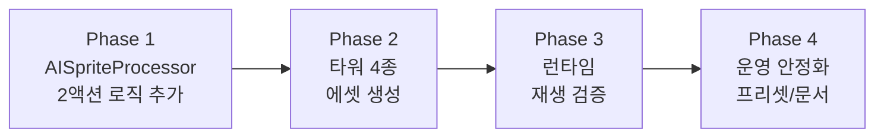

# 타워 본체 애니메이션 적용 계획 (Barracks 본체 + 일반 타워)
> 작성일: 2026-02-22
> 대상: Barracks 타워 본체, Archer/Mage/Artillery 타워 본체
> 제외: 배럭 병사(Barracks Soldier), 적 유닛(Enemy)
> 소스 생성 툴: `AISpriteProcessor` (`TowerBase` 탭)

---

## 1. 목표
타워 본체 애니메이션 파이프라인을 `Idle/Attack` 2액션으로 표준화하고, 런타임에서 타워 종류별로 안정적으로 재생되게 한다.

핵심 목표:
1. 타워 본체는 2상태(`Idle`, `Attack`)만 사용한다.
2. 배럭 병사/적 유닛의 4액션 규칙(`Idle/Walk/Attack/Die`)과 명확히 분리한다.
3. `TowerConfig` 기반 경로 지정 + 컨벤션 fallback으로 운영 가능하게 한다.

### 1.1 성공 지표 (KPI)
- 기능 지표: 타워 4종 모두 `Idle/Attack` 전환이 눈으로 확인된다.
- 안정성 지표: Animator 누락/파라미터 누락 상황에서 크래시 0건.
- 회귀 지표: 배럭 병사/적/히어로 4액션 체계 회귀 이슈 0건.
- 운영 지표: 신규 타워 1종 추가 시 동일 절차로 30분 내 적용 가능.

---

## 2. 범위

### In Scope
- Barracks 타워 본체 애니메이션
- Archer, Mage, Artillery 타워 본체 애니메이션
- `AISpriteProcessor`에서 `TowerBase` 탭 기반으로 `Idle/Attack` 2액션 추출
- 타워 전용 2액션 Animator Controller 생성 로직 추가
- 런타임 `MotionState` 연동(Idle=0, Attack=2)

### Out of Scope
- Barracks Soldier 애니메이션(별도 4액션 체계 유지)
- Enemy 애니메이션(스마트 슬라이스 4액션 체계 유지)
- 타워 본체 `Walk`/`Die` 상태는 구조적으로 미사용(추가 금지)
- 최종 VFX/SFX/아트 리터치

---

## 3. 현재 코드 상태 분석

### 3.1 런타임 (`TowerManager.TowerRuntime`) — ✅ 이미 구현됨
`TowerManager.cs` 내부 `TowerRuntime` 클래스에 2액션 애니메이션 재생 로직이 **이미 존재**한다.

```csharp
// TowerManager.cs L1383-L1385
private static readonly int MotionStateHash = Animator.StringToHash("MotionState");
private const int MotionStateIdle = 0;
private const int MotionStateAttack = 2;
```

**주요 메서드:**
| 메서드 | 역할 |
|--------|------|
| `TickTowerAnimation(deltaTime)` | `_animAttackTimer`를 매 프레임 감소 |
| `MarkTowerAttack(cooldown)` | 공격 발생 시 타이머를 Attack 클립 길이 또는 쿨다운의 45%로 세팅 |
| `RefreshTowerAnimationState()` | `_animAttackTimer > 0`이면 `MotionState=2(Attack)`, 아니면 `0(Idle)` |
| `ResolveAnimatorClipLength(...)` | `"attack"`, `"atk"`, `"fire"`, `"shot"` 토큰으로 Attack 클립 길이를 자동 감지 |
| `HasIntParameter(animator, hash)` | `MotionState` 파라미터 존재 여부를 확인해 fallback 안전성 보장 |

**fallback 동작:**
- `_useAnimator` 플래그로 Animator/Controller 부재 시 정적 스프라이트 모드 자동 전환
- `_hasMotionStateParameter`로 파라미터 누락 시에도 크래시 없이 동작

### 3.2 Animator Controller 해석 경로 (`ResolveTowerAnimatorController`) — ✅ 이미 구현됨
`TowerConfig.RuntimeAnimatorControllerPath` 우선 → 컨벤션 기반 4단 fallback:

```
1. config.RuntimeAnimatorControllerPath (명시 지정)
2. Animations/Towers/{TowerId}/{TowerId}
3. Animations/Towers/{TowerTypeName}/{TowerTypeName}
4. Animations/Towers/{TowerId}
5. Animations/Towers/{TowerTypeName}
```

> **결론:** 런타임은 이미 준비 완료. 에셋(클립 + 컨트롤러)만 생성하면 된다.

### 3.3 에디터 (`AISpriteProcessor`) — ⚠️ 수정 필요

#### 현재 상태
- `TowerBase` 탭이 존재하며 `TowerConfig`를 선택해 스프라이트 바인딩 가능
- 그러나 **Animator Controller 생성은 4액션 전용** (`CreateOrUpdateAnimatorController`)
  - Walk(1) / Die(3) 상태를 항상 포함
  - `BaseUnitTargetType` enum에 타워 항목이 없어 `TryEnsureAnimatorOutputFolder` 경로가 타워를 인식 못함
- 타워용 2액션 컨트롤러 생성 로직이 **아직 없음**

#### 필요한 변경
| 항목 | 현재 | 목표 |
|------|------|------|
| AnimatorController 생성 | 4상태(Idle/Walk/Attack/Die) 전용 | 2상태(Idle/Attack) 전용 오버로드 추가 |
| 출력 폴더 | `Animations/{Enemies\|Heroes\|Barracks}/` | `Animations/Towers/{TowerId}/` 추가 |
| 이름 기반 프레임 분류 | 4행(row 0~3) 고정 | 2행(Idle/Attack) 또는 이름 토큰 분류 |
| TowerConfig 바인딩 | `RuntimeSpriteResourcePath`만 | `RuntimeAnimatorControllerPath` 자동 기입 추가 |

### 3.4 `TowerConfig` ScriptableObject — ✅ 필드 존재
```csharp
// TowerConfig.cs L87
public string RuntimeAnimatorControllerPath;
```
- 타워 4종 Config 에셋에 해당 필드가 이미 있으므로 컨트롤러 경로만 채우면 됨
- 레벨별 `TowerLevelData.SpriteResourcePath`와 별개로 본체 전체에 1개 컨트롤러 적용

---

## 4. 설계 원칙
1. 타워 본체는 이동/사망 상태가 없는 오브젝트이므로 2액션이 기본값이다.
2. `Attack`은 "실제 발사/타격 시점"에만 짧게 재생하고, 이후 `Idle`로 복귀한다.
3. 애니메이터가 없거나 파라미터 불일치 시 기존 정적 스프라이트 동작을 보장한다(강건성 우선).
4. `Attack` 클립 재생 시간은 `ResolveAnimatorClipLength`가 자동 감지하므로, 클립 이름에 `attack` 토큰만 포함하면 수동 설정 불필요.

---

## 5. 에셋 규격

### 5.1 액션 세트
| 액션 | 루프 여부 | MotionState 값 | 비고 |
|------|----------|----------------|------|
| `Idle` | 루프 | 0 | 기본 상태, 공격 안 할 때 항상 재생 |
| `Attack` | 비루프 | 2 | 공격 발생 시 클립 길이만큼 재생 후 Idle 복귀 |

> ⚠️ `MotionState=1(Walk)`과 `3(Die)`은 타워에서 **사용하지 않는다**. 적/병사 체계와의 값 충돌을 피하기 위해 정수를 건너뛰었다.

### 5.2 권장 네이밍
- 스프라이트/클립:
  - `<TowerId>_idle.anim`
  - `<TowerId>_attack.anim`
- 컨트롤러:
  - `<TowerId>.controller`

### 5.3 리소스 경로 규격
```
Assets/Resources/Animations/Towers/<TowerId>/
├── <TowerId>_idle.anim
├── <TowerId>_attack.anim
└── <TowerId>.controller
```

예시:
| 타워 | 컨트롤러 Resources 경로 (확장자 제외) |
|------|--------------------------------------|
| Archer | `Animations/Towers/Archer/Archer` |
| Barracks | `Animations/Towers/Barracks/Barracks` |
| Mage | `Animations/Towers/Mage/Mage` |
| Artillery | `Animations/Towers/Artillery/Artillery` |

> `ResolveTowerAnimatorController`의 fallback 경로와 이미 부합하므로, `TowerConfig.RuntimeAnimatorControllerPath`를 비워두더라도 자동 탐색된다.

### 5.4 스프라이트 시트 입력 형식
- **2행 시트** 권장: 상단 = Idle 프레임, 하단 = Attack 프레임
- SmartSlice의 `SplitActionsByRows` 활성 시 Y좌표 기준으로 자동 행 분리
- 대안: `_idle_`, `_attack_` 토큰이 포함된 개별 이미지도 가능

---

## 6. 구현 단계

### Phase 1. `AISpriteProcessor`에 2액션 추출/컨트롤러 생성 추가 (P0)

**작업:**
1. `CreateOrUpdateAnimatorController` 2액션 오버로드 추가
   - 파라미터: `MotionState(int)` 단일
   - 상태: `Idle(0)` + `Attack(2)` 만 생성 (Walk/Die 생략)
   - 전이: `AnyState → Idle (MotionState==0)`, `AnyState → Attack (MotionState==2)`
2. `TryEnsureAnimatorOutputFolder`에 타워 출력 경로 분기 추가
   - 출력: `Assets/Resources/Animations/Towers/{TowerId}/`
3. 스프라이트 프레임을 2액션으로 분류하는 로직 추가
   - 2행 시트: 행 0 → Idle, 행 1 → Attack
   - 이름 토큰 방식: `_idle_` / `_attack_` 필터
4. `TowerBase` 탭의 "Apply Binding" 동작에 컨트롤러 생성 + `TowerConfig.RuntimeAnimatorControllerPath` 자동 기입 추가

**완료 기준(DoD):**
- `AISpriteProcessor` TowerBase 탭에서 2행 시트를 넣으면 `idle.anim`, `attack.anim`, `.controller`가 올바른 경로에 생성됨
- `TowerConfig.RuntimeAnimatorControllerPath`에 Resources 경로가 자동 기입됨
- `Walk/Die` 클립이 생성되더라도 컨트롤러 상태머신에는 포함되지 않음(타워 본체 기준)

---

### Phase 2. 타워 4종 에셋 생성 (P0)

**작업:**
1. 타워 4종(`Archer`, `Barracks`, `Mage`, `Artillery`)의 2행 스프라이트 시트 준비
   - 기존 정적 스프라이트에서 Idle 프레임을 추출하고, Attack 프레임은 간단한 변형(발사 모션, 짧은 흔들림 등)으로 제작
2. `AISpriteProcessor` TowerBase 탭으로 각 타워의 클립 + 컨트롤러 생성
3. 각 `TowerConfig` 에셋에 `RuntimeAnimatorControllerPath` 확인/적용
   - 경로가 이미 fallback과 부합하면 비워두는 것도 허용

**완료 기준(DoD):**
- 4개 타워 모두 `Idle`, `Attack` 클립 + 컨트롤러 생성 확인
- `Resources.Load` 경로로 각 컨트롤러 로드 가능 확인
- 클립 네이밍 규칙(`attack` 토큰 포함) 100% 충족

---

### Phase 3. 런타임 바인딩/재생 검증 (P0)

**작업:**
1. 런타임 생성 시 타워 본체에 Animator 부착 여부 확인
   - `TowerRuntime` 생성자에서 `_useAnimator` 플래그가 `true`로 설정되는지 로그 확인
2. 공격 이벤트 시 `MotionState=2`, 평시 `MotionState=0` 동작 검증
3. `_animAttackDuration`이 생성한 Attack 클립 길이를 정확히 반영하는지 확인
   - `ResolveAnimatorClipLength`가 토큰 `"attack"`으로 매칭하므로 클립 이름에 `attack` 포함 필수

**완료 기준(DoD):**
- 전 타워 본체에서 공격 타이밍에 Attack 재생 확인
- 컨트롤러 누락 시 크래시 없이 정적 스프라이트 fallback 확인
- `_animAttackDuration` 값이 실제 클립 길이와 일치 확인
- 레벨업(1->2, 2->3) 후에도 Attack/Idle 상태 전환이 유지됨 확인

---

### Phase 4. 운영 안정화 (P1)

**작업:**
1. `TowerBase_2Action` 프리셋을 `AISpriteProcessor`에 저장/공유
   - SmartSlice 설정 + 2행 분리 옵션 포함
2. 신규 타워 추가 시 체크리스트 문서화
3. QA 스모크 시나리오를 task/log에 연결

**완료 기준(DoD):**
- 같은 절차로 신규 타워 1종 추가 시 30분 내 파이프라인 재현 가능

### Phase Gate (진행/중단 기준)
- Gate A (Phase 1 종료): 에디터에서 2액션 컨트롤러 자동 생성이 재현 가능할 것.
- Gate B (Phase 2 종료): 4타워 컨트롤러가 모두 생성되고 경로 해석 실패가 없어야 할 것.
- Gate C (Phase 3 종료): 런타임 스모크 12개 항목 전부 통과할 것.
- Gate Fail 처리: Gate 실패 시 다음 Phase 진행 금지, 실패 원인 1건당 수정/재검증 1사이클 수행.

---

## 7. QA 체크리스트 (스모크)

### 애니메이션 재생 검증
| # | 시나리오 | 기대 결과 |
|---|---------|----------|
| 1 | Archer 공격 시 | Attack 클립 재생 → Idle 복귀 |
| 2 | Mage 공격 시 | Attack 클립 재생 → Idle 복귀 |
| 3 | Artillery 공격 시 | Attack 클립 재생 → Idle 복귀 |
| 4 | Barracks 본체 (병사 아님) | Attack 클립 재생 → Idle 복귀 |
| 5 | 장시간 공격 없음 | Idle 루프 유지 |
| 6 | 연속 공격 (쿨다운 짧음) | Attack→Idle→Attack 전환 자연스러움 |

### 기존 체계 회귀 검증
| # | 시나리오 | 기대 결과 |
|---|---------|----------|
| 7 | Barracks Soldier 4상태 | Walk/Attack/Die 정상 동작 |
| 8 | Enemy 4상태 | Walk/Attack/Die 정상 동작 |
| 9 | 히어로 4액션 | Idle/Walk/Attack/Die 정상 동작 |

### fallback 검증
| # | 시나리오 | 기대 결과 |
|---|---------|----------|
| 10 | 컨트롤러 파일 삭제 후 실행 | 정적 스프라이트로 fallback (크래시 없음) |
| 11 | MotionState 파라미터 삭제 | `_hasMotionStateParameter=false`, Idle 고정 |
| 12 | `RuntimeAnimatorControllerPath` 비워둠 | 컨벤션 경로 fallback 동작 |

---

## 8. 리스크 및 대응

| # | 리스크 | 영향 | 대응 |
|---|-------|------|------|
| 1 | `Attack` 클립 길이가 제각각이라 타격 타이밍이 어긋남 | 공격 피드백이 부자연스러운 느낌 | 공격 시점은 기존 전투 로직(`_cooldownLeft`) 기준 유지, 애니메이션은 시각 연출로만 취급. `MarkTowerAttack`의 fallback 윈도우(`쿨다운 * 0.45, 최소 0.08 ~ 최대 0.35초`)가 이미 보정 처리 |
| 2 | 타워 에셋 누락으로 Animator 바인딩 실패 | 애니메이션 없이 정적 표시 | `ResolveTowerAnimatorController`의 5단 탐색 + `_useAnimator` fallback으로 크래시 방지 |
| 3 | SmartSlice 4액션 프리셋을 실수로 타워에 적용 | Walk/Die 클립이 불필요하게 생성됨 | 타워 전용 프리셋(`TowerBase_2Action`)을 기본값으로 고정 + 2액션 컨트롤러 생성 로직이 Walk/Die를 무시 |
| 4 | 레벨별 스프라이트(`SpriteOverride`/`SpriteResourcePath`)와 애니메이션 충돌 | 레벨업 시 외형이 바뀌는데 애니메이터 클립은 Lv1 스프라이트 기준 | **Phase 1 범위에서는 레벨별 컨트롤러 분리를 하지 않음.** 향후 확장으로 `TowerLevelData`에 `AnimatorControllerPath` 추가 검토 |
| 5 | `ResolveAnimatorClipLength`가 클립 이름을 못 찾는 경우 | `_animAttackDuration`이 기본값 0.2초로 세팅됨 | 0.2초 기본값은 대부분의 짧은 공격 모션에 적합. 클립 이름에 반드시 `attack`/`atk`/`fire`/`shot` 토큰 포함할 것 |

---

## 8.1 롤백 기준
- 기준 1: 타워 본체 애니메이션 적용 후 전투/입력/저장 관련 치명 버그 1건 이상 발생 시 즉시 롤백.
- 기준 2: 배럭 병사/적 4액션 회귀가 1건이라도 재현되면 즉시 롤백 후 분리 원인 분석.
- 기준 3: 성능 저하(프레임 드랍)가 기존 대비 체감될 경우 컨트롤러 적용 범위를 단계적으로 축소.

## 8.2 변경 관리 원칙
- 한 번에 전부 배포하지 않고 `Archer -> Mage -> Artillery -> Barracks 본체` 순서로 점진 적용.
- 단계별 검증 완료 전 다음 타워 타입으로 확장하지 않는다.
- 경로/네이밍 변경은 문서와 에셋을 같은 커밋 단위로 동기화한다.

---

## 9. 실행 순서 (요약)



1. `AISpriteProcessor`에 타워 전용 2액션(`Idle/Attack`) 컨트롤러 생성 로직 추가
2. 타워 4종 스프라이트 시트 → 클립 + 컨트롤러 생성
3. 각 `TowerConfig`에 `RuntimeAnimatorControllerPath` 설정 (또는 컨벤션 fallback 확인)
4. 게임씬 스모크 테스트(타워별 1회 이상 공격 확인 + fallback 검증)
5. 로그/작업상세 기록

---

## 10. 산출물

| 산출물 | 수량 | 경로 |
|--------|------|------|
| 애니메이션 클립 | 타워당 2개 (idle, attack) × 4종 = **8개** | `Assets/Resources/Animations/Towers/{TowerId}/` |
| Animator Controller | 타워당 1개 × 4종 = **4개** | `Assets/Resources/Animations/Towers/{TowerId}/` |
| 코드 변경 | `AISpriteProcessor.cs` (2액션 컨트롤러 생성 + 폴더 경로) | `Assets/Scripts/Kingdom/Editor/` |
| 설정 반영 | 타워별 `TowerConfig.RuntimeAnimatorControllerPath` | 기존 에셋 수정 |
| 검증 기록 | 스모크 테스트 로그 | `문서/진행/작업상세로그_YYYY_MM_DD.md` |

---

## 부록 A. 관련 코드 참조 맵

```
[에디터]
AISpriteProcessor.cs
├── DrawTowerBaseTab()          — TowerBase 탭 UI
├── TryApplyTowerBinding()      — 스프라이트 바인딩
├── CreateOrUpdateAnimatorController()    — ⚠️ 현재 4액션 전용
├── CreateOrUpdateActionClip()  — 액션 클립 생성
└── TryEnsureAnimatorOutputFolder()       — ⚠️ 타워 경로 미포함

[런타임]
TowerManager.cs
├── ResolveTowerAnimatorController()      — 컨트롤러 탐색 (5단 fallback)
└── TowerRuntime (내부 클래스)
    ├── MotionStateHash / Idle=0 / Attack=2
    ├── TickTowerAnimation()              — 타이머 감소
    ├── MarkTowerAttack()                 — 공격 시 타이머 세팅
    ├── RefreshTowerAnimationState()      — Animator 파라미터 갱신
    └── ResolveAnimatorClipLength()       — 클립 길이 자동 감지

[데이터]
TowerConfig.cs
├── RuntimeAnimatorControllerPath        — 컨트롤러 경로 (string)
├── RuntimeSpriteResourcePath            — 정적 스프라이트 fallback
└── TowerLevelData.SpriteResourcePath    — 레벨별 스프라이트
```

---

## 부록 B. MotionState 정수 매핑 (전 유닛 통합)

| 값 | 의미 | 사용 유닛 |
|----|------|----------|
| 0 | Idle | 타워, 적, 배럭 병사, 히어로 |
| 1 | Walk / Move | 적, 배럭 병사, 히어로 |
| 2 | Attack | 타워, 적, 배럭 병사, 히어로 |
| 3 | Die | 적, 배럭 병사, 히어로 |

> 타워는 0과 2만 사용하므로 다른 유닛과 정수값이 충돌하지 않는다.

---

## 부록 C. 실행 전 확정 필요사항 (Open Questions)
1. `AISpriteProcessor`에서 타워 2액션 분류를 \"행 기준(2행)\"으로 고정할지, \"이름 토큰\" 병행 허용할지 최종 결정 필요.
2. `TowerConfig.RuntimeAnimatorControllerPath`를 항상 명시할지, 컨벤션 fallback 우선으로 둘지 운영 정책 결정 필요.
3. `Attack` 클립이 비루프/루프 중 어떤 형태를 팀 표준으로 둘지 결정 필요.
4. 레벨별 외형 차이를 추후 `AnimatorController` 분리로 확장할지(차기 트랙) 여부 결정 필요.

### 결정사항 (2026-02-22)
1. 2액션 분류 방식: `2행 기준` 기본 + `이름 토큰` 폴백 허용
2. `RuntimeAnimatorControllerPath` 운영: 타워 4종 모두 `항상 명시`
3. `Attack` 클립 표준: `비루프` 사용
4. 레벨별 컨트롤러 확장: 이번 트랙에서는 `미분리`(타워당 공통 컨트롤러 1개)

### 반영 규칙
- `AISpriteProcessor` 입력 우선순위: 2행 분리 성공 시 해당 결과 사용, 실패 시 `_idle_`/`_attack_` 토큰 분류로 폴백.
- 타워 Config 변경 시 `RuntimeAnimatorControllerPath` 누락을 허용하지 않는다(검수 체크 항목 고정).
- `Attack` 클립 Import 설정에서 Loop Time 해제 상태를 기본값으로 유지한다.
- 레벨업 외형 차이는 기존 `SpriteResourcePath`/`SpriteOverride` 정책으로 유지하고, Animator 레벨 분리는 차기 트랙으로 이관한다.

---

본 계획은 "타워 본체 2액션" 표준화를 목표로 하며, 병사/적의 4액션 체계와 분리 운영한다.
